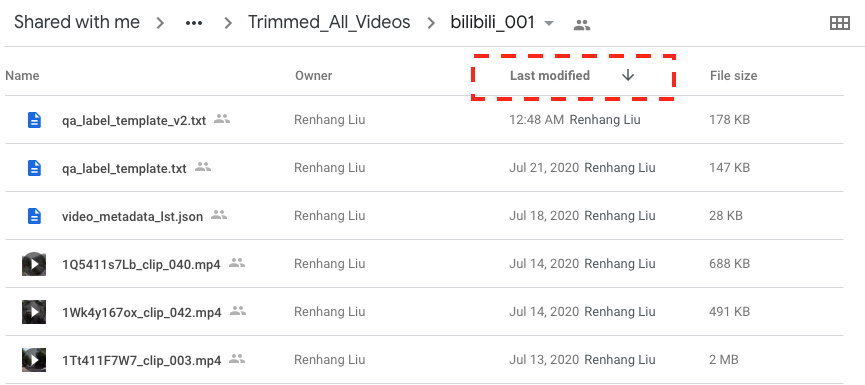

# EasyLabel

### Note: Every point in this document is important, as we are dealing with a huge amount of data, fully understanding this document will speed up the process, avoid re-work, and reduce human errors.

### `qa_label_template.txt` Example

```
~~~~~~~~~~~~~~~~~~~~ 127411s7T7_clip_039 ~~~~~~~~~~~~~~~~~~~~~~~~~~~~~~~~~~~~~~~
<LENGTH> 1.74s
<DIM> (W)1920 x (H)1080
<PERSPECTIVE>: {{  }}
<RE_TRIM>: {{ START_TS, END_TS }}
<CRITICAL_POINT>: {{ TS }}

--------------------{{  }}
<QASet_ID>: {{ None }}
<ANS>: {{  }}


--------------------{{  }}
<QASet_ID>: {{ None }}
<ANS>: {{  }}


--------------------{{  }}
<QASet_ID>: {{ None }}
<ANS>: {{  }}


--------------------{{  }}
<QASet_ID>: {{ None }}
<ANS>: {{  }}


--------------------{{  }}
<QASet_ID>: {{ None }}
<ANS>: {{  }}
```

## How to do Labelling for Videos

### 0. Download your QA Label Template

- Go to this Google Sheet: [UROP_CV_2020_Shared / Video Dataset Progress Tracking](https://docs.google.com/spreadsheets/d/12tvNBGJzpzskT4ZmeruZGbDlNZmhisch0DM0Xb59rvU/edit#gid=1408681658)
    1. At the `Labelling Process` tab, choose a `TODO` task.
    2. Put your name under `Labelled by`
    3. Change `TODO` to `In Progress`
    4. Remember the `Folder Name` you picked
- Go to this folder: [UROP_CV_2020_Shared / Video_Folders / Trimmed_All_Videos](https://drive.google.com/drive/folders/17w9hVg67dcB5aFhb-Y35tV7-EDsQjVfj?usp=sharing)
    1. Go to the `Folder Name` you picked.
    2. **Sort the folder by `Last Modified` in descending (reverse) order.**
    
    3. Download the latest version of `qa_label_template` file inside the folder. `qa_label_template_v2.txt` is the latest version in this case.
    4. The order of the videos inside the `qa_label_template` should be the same as Google Drive's order now, which is sorted by last modified time in descending order.
    5. If you download all videos to local, and sort them by last modified time, the order should remain same and consistent.

### 1. To label which perspective the video is being shot at

- A video can be either 1st-person perspective or 3rd-person perspective
    - 1st-person perspective could be any of these scenarios:
        - The camera is mounted inside a car, and the car itself is directly involved in an accident, including the car hitting another car, or the car is hit by another car.
        - The camera is handheld, but whoever holding the camera is directly involved in the event / car crash / accident.
    - 3rd-person perspective could be any of these scenarios:
        - The camera is mounted inside a car, and it is observing an accident happening on other cars but not itself.
        - The camera is handheld by a pedestrian, and it is observing an accident from distance.
        - The camera is a stationary CCTV camera mounted over the head.
- The `qa_label_template.txt` has this line for every video section.
    ```
    <PERSPECTIVE>: {{  }}
    ```
- Just use number `1` or `3` to indicate 1st-person perspective or 3rd-person perspective.
- Example:
    - `<PERSPECTIVE>: {{ 1 }}`
    - `<PERSPECTIVE>: {{ 3 }}`

### 2. Check if the video requires re-trimming refinement

- If the start and the end of the video clip show any frame from adjacent events from the original video compilation, we need to re-trim the video to remove the unrelated portion.
- To re-trim, just provide the `START_TS` (starting timestamp) and the `END_TS` (ending timestamp) **of the part of the video that we want to keep**.
- The `qa_label_template.txt` has this line for every video section.
    ```
    <RE_TRIM>: {{ START_TS, END_TS }}
    ```
- `START_TS` and `END_TS` should strictly follow the [Time Format](#time-format).
- If no re-trimming is needed, leave the line `{{ START_TS, END_TS }}` as it is.
- You can only provide one timestamp, either `START_TS` or `END_TS`.
    - E.g. You can only replace `START_TS` to `00:03`, and leave `END_TS` as it is. In this way, you are telling the script that you want to trim and keep the video from `00:03` till the end of the video.

### Time Format

- Sexagesimal (HOURS:MM:SS.MILLISECONDS).
- Most common format would be: `MM:SS`
    - Example:
        - `00:12` interpreted as 12 seconds
        - `01:23` interpreted as 1 minute, 23 seconds
- If you want to be precise on the trimming point, especially for `<CRITICAL_POINT>`, because some accidents happen in a fraction of a second, you can use `MM:SS.MILLISECONDS`
    - Example:
        - `3` interpreted as 3 seconds.
        - `15.6` interpreted as 15.6 seconds.
        - `15.25` interpreted as 15 seconds and 1/4 second.
        - `02:30.05` interpreted as 2 minutes, 30 seconds, and 5/100 of a second.
        - `02:30.189` interpreted as 2 minutes, 30 seconds, and 189/1000 of a second.

### 3. Provide the critical timestamp for `Predictive` or `Reverse Inference` type of question.

- If you want to ask either `Predictive` or `Reverse Inference` type of question to a video, you would need to cut the video in half, because only half of the video is shown to the DL Model, while the other half of the video will be reserved as a proof of the answer.
- The **critical timestamp** or the **critical point** is where you want to cut the video, you only need to provide a single `TS` (timestamp), our script will later cut the video into two parts:
    1. from video start to `TS`
    2. from `TS` to video end.
- The `qa_label_template.txt` has this line for every video section.
    ```
    <CRITICAL_POINT>: {{ TS }}
    ```
- Replace `TS` with a timestamp that follows [Time Format](#time-format), or leave it as it is if this video does not have `Predictive` nor `Reverse Inference` question type.

*Special notes:*
- Each video should only have either one `Predictive` or `Reverse Inference`, not both.
- Which part of the video will be used as question will be determined by the question type.
    - If `Predictive`, first part of the video will be used as `question video`.
    - if `Reverse Inference`, the second part of the video will be used as `question video`.
- When there is a `<CRITICAL_POINT>` present, other questions under that video should only based on the `question video`.
- When `<RE_TRIM>` and `<CRITICAL_POINT>` both present, the timestamp of the `<CRITICAL_POINT>` should still based on original video timeline, hence, the `<CRITICAL_POINT>` timestamp should between `START_TS` and `END_TS`, otherwise it will be flagged out as an error.

### 4. Ask a question

- Each question section looks like this:
    ```
    --------------------{{  }} // Q Type: use [1-6]|[d|e|p|r|c|i]
    <QASet_ID>: {{ None }}
    <ANS>: {{  }}
    ```
- **On the 1st line,** fill in the question type in the double curly braces:
    - use `1` or `d` for *Descriptive*.
    - use `2` or `e` for *Explanatory*.
    - use `3` or `p` for *Predictive*.
    - use `4` or `r` for *Reverse Inference*.
    - use `5` or `c` for *Counterfactual*.
    - use `6` or `i` for *Introspection*.
    - Example:
        ```
        --------------------{{ d }}
        ```
- **On the 2nd line**, this is used for `QASet` substitution, leave it as it is or see [About QASet substitution](#about-qaset-substitution).
- **On the 3rd line**, label the correct answer for the question.
    - Each question should have 2 to 5 options. (Only at extreme cases, we support up to 7 options)
        - use `a` or `A` for choosing the first option as the correct answer.
        - use `b` or `B` for choosing the second option as the correct answer.
        - ...
        - use `e` or `E` for choosing the fifth option as the correct answer.
    - **Multiple correct answers are also supported.**
        - use `ab` to represent both the first and the second options are correct answer.
    - Examples:
        - `<ANS>: {{ c }}` // lower case is acceptable
        - `<ANS>: {{ B }}` // upper case is acceptable
        - `<ANS>: {{ad}}`      // with or without whitespace is acceptable
        - `<ANS>: {{ e c b }}` // alphabets not in order is acceptable
- **On the 4th line**, which is the line right below the `<ANS>: {{  }}`, should be the start of a custom question and its corresponding options.
    - Put your question on the 4th line, and always end the question with a question mark `?`.
    - Put your options to the question down below, one option per line.
    - The first option corresponds to option `A`, the next line corresponds to option `B` and so on.
    - Instead of using `a/b/c/d` to indicate the correct answer, you can also use the plus sign `+` at the start of an option line as an alternative. For Example:
        ```
        <ANS>: {{  }}
        How many cars were involved in the accident?
        only one
        two
        three to five
        +more than five

        ```
    - You can even use `<ANS>` together with plus sign `+`, there is no harm to do so. In the following example, both option `A` and option `C` will be interpreted as correct answers.
        ```
        <ANS>: {{ a }}
        Which part of the car has been damaged?
        front
        left side
        +right side
        rear

        ```
    - `<ANS>: {{  }}` can be left empty if you have at least one plus sign `+` below indicating at least one correct answer, otherwise, it will be flagged out as unlabelled question.

### About Auto-Populated Questions and Options

- To speed up the process, we have pre-populated 7 basic questions for each video randomly.
- Your job now is mainly to review these questions together with the video clip.
    1. If the question and its options are slightly off the video context.
        - you should make necessary modifications on it.
    2. After you made the modifications, or, if the question and its options fits the video context perfectly at the first place.
        - you need to label the correct answer for that question using either `<ANS>` or `+` as you wish.
        - As long as you labelled the correct answer, that question will be deemed reviewed and confirmed, so it will be picked up by our parser in later stage.
    3. If the question and its options are totally off, which does not suit the video at all.
        - you can remove the question section from the label file.
        - Alternatively, you can leave it as it is, because a question with no correct answer labelled will be ignored anyway.
    4. If all 7 pre-populated questions can be used, keep them all.
    5. After removing the unfit questions, you should make sure there are at least 3 basic questions for every video.

### Label Option Disambiguation

- Please refer to [this](disambiguation.md) document for details.


### About QASet Substitution

##### Labelling Process

- You need to maintain a local QA Bank for your own use.
    - Download QA Bank Template as excel from [here](https://docs.google.com/spreadsheets/d/1PhhQFOBWPwpAsuHzdv8W1L4vT3FrS9pA7363CM2dVgg/edit?usp=sharing).
    - Populate and maintain this QA Bank excel sheet at your local, **be careful not to overwrite/ update questions that have been referenced by your label files**.
    - Key points to note:
        - This excel sheet should have only one tab.
        - The header row (first row) must not be changed.
        - Each question should have a unique ID (positive integer), except rephrased questions.
- To label a video using your local QA Bank
    - simply provide the question ID in your label file at `<QASet_ID>: {{  }}`, then label the correct answer at `<ANS>: {{  }}`. Example:
        ```
        --------------------{{  }}
        <QASet_ID>: {{ 5 }}
        <ANS>: {{ a }}

        ```
    - you don't need to provide the question type, since the parser will get the question type info from your QA bank later.
    - If you want to add additional options to the QA, you may do so below the `<ANS>: {{  }}` line, these additional options will be appended to the existing options list from your QA bank for this particular question.
    - If the correct answer is among the additional options, you may use either `<ANS>` or `+` as you wish, or even in combination. **But**, note that if the QASet from your QA Bank has 4 options, and you have provided two additional options, the indexes for the two additional options are `E` & `F`. Example:
        ```
        --------------------{{  }}
        <QASet_ID>: {{ 5 }}
        <ANS>: {{  }}
        red
        +green

        --------------------{{  }}
        <QASet_ID>: {{ 19 }}
        <ANS>: {{ ab }}
        Stop sign
        +Merging lane sign
        Speed sign

        ```

##### Parsing Process

- **Step 1**: Export your QA Bank excel sheet to `json` format.
    ```bash
    qabank "YOUR_QA_BANK_EXCEL_FILE _ATH_HERE"
    ```
    *Example*

    This will validate and export your QA Bank `QA_BANK.xlsx` to `QA_BANK.json`.
    ```bash
    qabank "QA_BANK.xlsx"
    ```

- **Step 2**: Parse your Label File with QASet Substitution
    ```bash
    parse "YOUR_LABEL_FILE_PATH_HERE" "YOUR_QA_BANK_JSON_FILE_PATH_HERE"
    ```
    *Example*

    This will validate and export your label file `qa_label.txt` into `.json` format.
    ```bash
    parse "qa_label.txt" "QA_BANK.json"
    ```


### Completed Label `.txt` File Example

```
~~~~~~~~~~~~~~~~~~~~ 127411s7T7_clip_039 ~~~~~~~~~~~~~~~~~~~~~~~~~~~~~~~~~~~~~~~
<LENGTH> 1.74s
<DIM> (W)1920 x (H)1080
<PERSPECTIVE>: {{ 3 }}
<RE_TRIM>: {{ 00:02, 00:15 }}
<CRITICAL_POINT>: {{ 00:12 }}

--------------------{{ d }}
<QASet_ID>: {{ None }}
<ANS>: {{ a }}
Did a person cross the road in the video?
yes
no

--------------------{{ d }}
<QASet_ID>: {{ None }}
<ANS>: {{ d }}
How many cars were involved in the accident?
only one
two
three to five
more than five


--------------------{{ d }}
<QASet_ID>: {{ None }}
<ANS>: {{  }}
What's the colour of the traffic light when the car pass under?
green
yellow
+red
no traffic light

--------------------{{ e }}
<QASet_ID>: {{ None }}
<ANS>: {{ a }}
What kind of accident happened in the video?
Rear-end
side-collision
road-departure
head-on

--------------------{{ p }}
<QASet_ID>: {{ None }}
<ANS>: {{ b }}
is the car on the right going to change lane?
yes
no

```

### Label File Checking and Parsing After Labelling Done

- We have packaged the validation tool into a python package, so you just need to `pip install` it.
- You can install it in a python `virtualenv`, but installing it globally is also fine, because it is pretty lightweight, and you can uninstall it after we are done with it.

#### Usage

1. Install the package
    ```bash
    pip3 install --upgrade easylabeltool
    ```

2. Parse your Label file
    ```bash
    parse "YOUR_LABEL_FILE_PATH_HERE"
    ```

    *Example*

    This will validate and export your label file `qa_label_template.txt` into `.json` format
    ```bash
    parse "bilibili_003/qa_label_template.txt"
    ```

3. Upload your Label file

- Rename your `qa_label_template.txt` to `[folder_name].txt`, such as `bilibili_003.txt`
- Rename the generated `qa_label.json` to `[folder_name].json`, such as `bilibili_003.json`
- Upload both files into this folder: [UROP_CV_2020_Shared / Video_Folders / Label_Files](https://drive.google.com/drive/folders/1WfNHVw-acACT1GDt8s18TESTQFcIfArd?usp=sharing)
