# Disambiguation

### City vs Town

| Modern City | Small Town |
| :---: | :---:|
|  |  |
| High-rise buildings | one-lane aged road, aged buildings |
|  |  |
| No building but clearly city, because it has multiple lane and well-maintained road and busy   | one-lane road, houses, not much traffic |

### Light Truck vs Heavy Truck

| Car Type | Sample | Notes |
| --- | --- | ---|
| Pickup Truck / Light Truck  |  | pick-up Truck|
| Pickup Truck / Light Truck  |  | box Truck|
| Pickup Truck / Light Truck  |  | light Truck|
| Trailer Truck / Heavy Truck  |  | trailer Truck|
| Trailer Truck / Heavy Truck  |  | 18-wheels |

### Motorcycle

Motorcycle includes all kinds of gasoline-powered, electric-powered motorbikes, motorcycles, Scooters as shown below. No need to distinguish between gasoline-powered and electric-powered.

| Car Type | Sample | Notes |
| --- | --- | ---|
| Motorcycle / Scooter  | 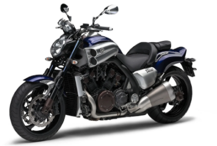 | |
| Motorcycle / Scooter  | 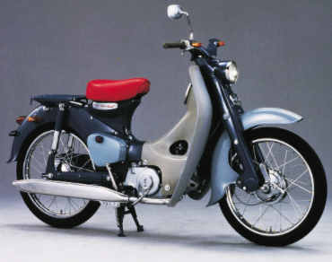 | |
| Motorcycle / Scooter  | 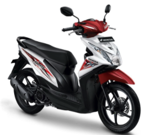 | |
| Motorcycle / Scooter  | 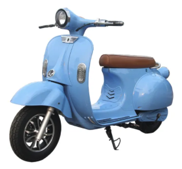 | |

### Non-motor Vehicles

| Car Type | Sample | Notes |
| --- | --- | ---|
| Bicycle / Tricycle / Non-motor Vehicles | 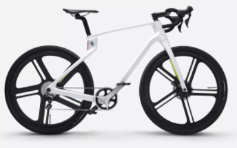 | |
| Bicycle / Tricycle / Non-motor Vehicles | 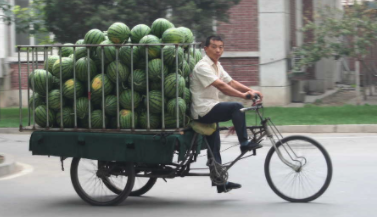 | |
| Bicycle / Tricycle / Non-motor Vehicles | 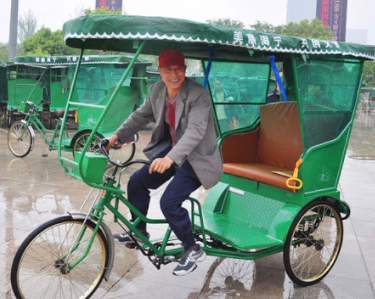 | |

### Sedan

| Car Type | Sample | Notes |
| --- | --- | ---|
| Sedan / General Car | 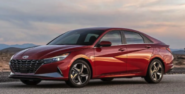 | 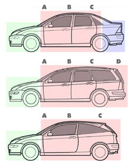 |

### SUV

| Car Type | Sample | Notes |
| --- | --- | ---|
| SUV / CUV | 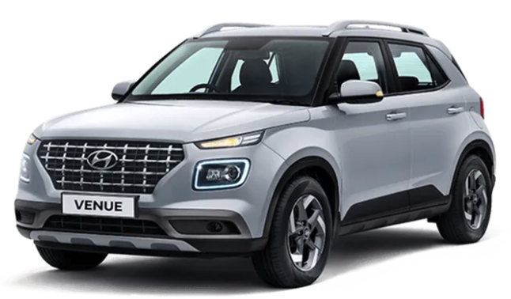 |  |
| SUV / CUV | 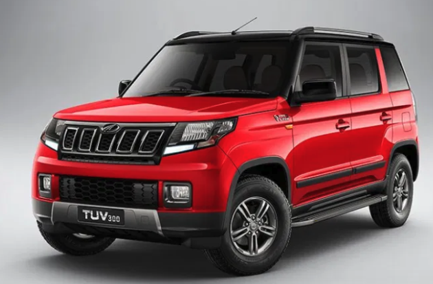 |  |
| SUV / CUV | 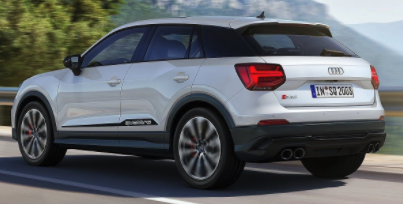 |  |
