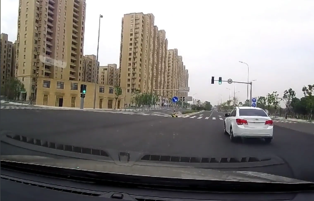
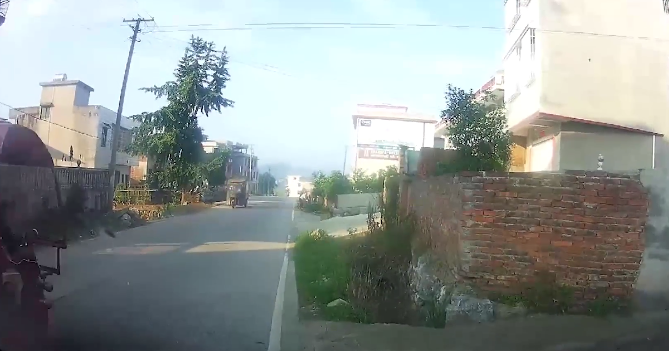
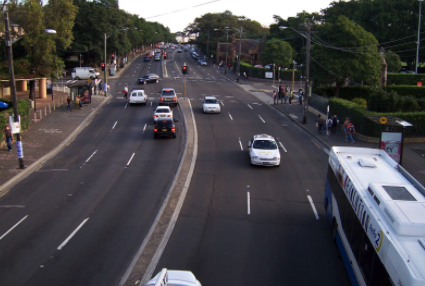
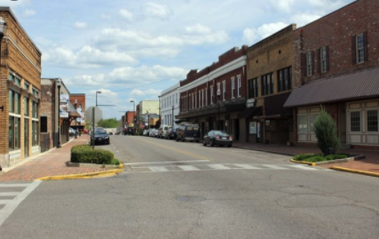
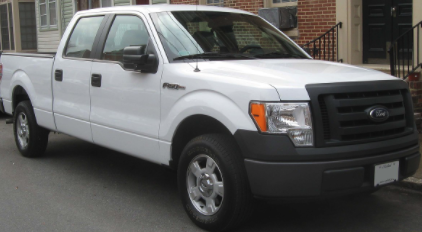
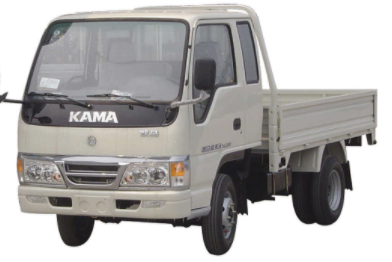
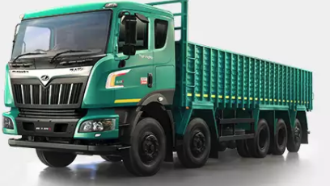
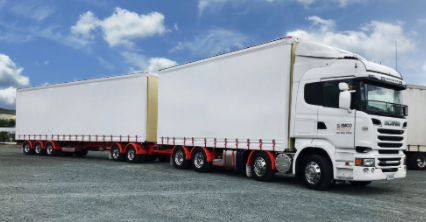

# Disambiguation

### City vs Town

| Modern City | Small Town |
| :---: | :---:|
|  |  |
| High-rise buildings | one-lane aged road, aged buildings |
|  |  |
| No building but clearly city, because it has multiple lane and well-maintained road and busy   | one-lane road, houses, not much traffic |

### Car Type

| Car Type | Sample | Notes |
| --- | --- | ---|
| Pickup Truck / Light Truck  |  | pick-up Truck|
| Pickup Truck / Light Truck  |  | box Truck|
| Pickup Truck / Light Truck  |  | light Truck|
| Trailer Truck / Heavy Truck  |  | trailer Truck|
| Trailer Truck / Heavy Truck  |  | 18-wheels |
